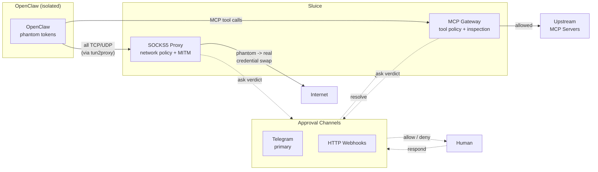

# Sluice

[](https://github.com/nnemirovsky/sluice/actions/workflows/ci.yml)
[](https://github.com/nnemirovsky/sluice/actions/workflows/e2e-linux.yml)
[](https://github.com/nnemirovsky/sluice/actions/workflows/lint.yml)
[](LICENSE)
[](https://goreportcard.com/report/github.com/nnemirovsky/sluice)
[](https://github.com/nnemirovsky/sluice/releases/latest)

```
 ___  _    _   _ ___ ___ ___
/ __|| |  | | | |_ _/ __| __|
\__ \| |__| |_| || | (__| _|
|___/|____|\___/|___\___|___|
```

Governance and credential injection proxy for [OpenClaw](https://github.com/openclaw/openclaw). Keeps real secrets out of the agent, enforces per-request policy on every connection and tool call, and puts a human in the loop when it matters.

## Why Sluice

AI agents need credentials to be useful. Giving them real credentials is dangerous.

**The problem:** OpenClaw makes API calls, opens network connections, and invokes MCP tools. Without governance, it can leak secrets in tool outputs, connect to unexpected endpoints, or make destructive API calls. No existing tool combines credential isolation, human approval, all-protocol interception, and MCP-level governance in one place.

**The solution:** Sluice intercepts everything at two layers and never gives OpenClaw real credentials.

| Layer | What it sees | What it governs |
|-------|-------------|-----------------|
| **MCP Gateway** | Tool names, arguments, responses | File writes, exec, deletions, any MCP tool call |
| **SOCKS5 Proxy** | Every TCP and UDP connection | HTTP, HTTPS, WebSocket, gRPC, SSH, IMAP, SMTP, DNS, QUIC/HTTP3 |

**Phantom token swap:** OpenClaw gets phantom tokens that look like real API keys. Sluice's MITM proxy swaps them for real credentials in-flight. If a phantom token leaks, it is useless outside the proxy.

**Human approval:** Connections and tool calls matching "ask" policy rules trigger a notification via Telegram or HTTP webhook. OpenClaw blocks until a human responds with Allow or Deny.

**Credential isolation:** Real secrets live in an encrypted vault (age, HashiCorp Vault, 1Password, Bitwarden, KeePass, or gopass). They are decrypted into zeroed memory only at injection time and never exposed to the agent process.

## How It Works



**Traffic flow:** OpenClaw runs in an isolated container (Docker, Apple Container, or macOS VM). All network traffic is routed through tun2proxy to sluice's SOCKS5 proxy. MCP tool calls go through the MCP gateway. Both layers evaluate every request against policy rules.

**Policy verdicts:** Each rule resolves to allow, deny, or ask. "Ask" verdicts are broadcast to all configured approval channels. The first channel to respond wins. Credentials are managed via Telegram commands or CLI, stored encrypted, and hot-reloaded into OpenClaw without restarts.

**Audit trail:** Every connection, tool call, approval, and denial is logged with blake3 hash chaining for tamper detection.

## Quick Start

### Docker (Linux)

The recommended setup for Linux. Three containers share a network namespace: sluice (proxy), tun2proxy (routes all traffic through SOCKS5), and OpenClaw.

```bash
# 1. Clone and configure
git clone https://github.com/nnemirovsky/sluice.git && cd sluice
cp examples/config.toml config.toml  # edit policy rules

# 2. Set Telegram credentials in compose.yml (environment section of sluice service)
#    TELEGRAM_BOT_TOKEN: "your-bot-token"
#    TELEGRAM_CHAT_ID: "your-chat-id"

# 3. Start (sluice + tun2proxy + openclaw)
docker compose up -d

# 4. Add API credentials (phantom tokens auto-generated, hot-reloaded to OpenClaw)
docker exec sluice sluice cred add anthropic_api_key \
  --destination api.anthropic.com --ports 443 \
  --header x-api-key
```

### Apple Container (macOS)

Native macOS micro-VMs via Virtualization.framework. Lightweight isolation with sub-second boot. Runs Linux guests. OpenClaw runs inside the micro-VM with all traffic routed through sluice.

```bash
# 1. Download sluice binary (see Releases page for latest version)
curl -L -o sluice https://github.com/nnemirovsky/sluice/releases/latest/download/sluice_darwin_arm64
chmod +x sluice

# 2. Generate CA certificate for HTTPS interception
./sluice cert generate

# 3. Seed policy and add credentials
./sluice policy import examples/config.toml
./sluice cred add anthropic_api_key \
  --destination api.anthropic.com --ports 443 --header x-api-key

# 4. Start sluice with Apple Container runtime
./sluice --runtime apple --container-name openclaw \
  --phantom-dir ~/.sluice/phantoms

# 5. Network routing (requires root for pf rules)
sudo ./scripts/apple-container-setup.sh

# 6. Start OpenClaw in Apple Container
container run --name openclaw \
  -e SSL_CERT_FILE=/certs/sluice-ca.crt \
  -e REQUESTS_CA_BUNDLE=/certs/sluice-ca.crt \
  -e NODE_EXTRA_CA_CERTS=/certs/sluice-ca.crt \
  -v ~/.sluice/ca:/certs:ro \
  -v ~/.sluice/phantoms:/phantoms:ro \
  ghcr.io/openclaw/openclaw:latest
```

### macOS VM (via tart)

Full macOS guest VM with access to Apple frameworks (iMessage, EventKit, Keychain, Shortcuts). Use this when OpenClaw needs to interact with Apple ecosystem services that are unavailable in Linux containers. Sluice manages the VM lifecycle and routes all traffic through the proxy.

```bash
# 1. Install tart and download sluice binary
brew install cirruslabs/cli/tart
curl -L -o sluice https://github.com/nnemirovsky/sluice/releases/latest/download/sluice_darwin_arm64
chmod +x sluice

# 2. Start sluice with macOS VM runtime (clones and boots the VM)
./sluice --runtime macos \
  --vm-image ghcr.io/cirruslabs/macos-sequoia-base:latest \
  --container-name openclaw \
  --phantom-dir /tmp/sluice-phantoms \
  --config examples/config.toml

# 3. Host network routing (requires root for pf rules)
sudo ./scripts/macos-vm-setup.sh
```

Requires macOS with Apple Silicon (M1+). The macOS EULA allows up to 2 additional macOS VMs per Apple-branded host.

### Standalone (binary)

Download a pre-built binary from [Releases](https://github.com/nnemirovsky/sluice/releases) and run sluice as a standalone proxy. No container runtime needed. Point OpenClaw at sluice manually.

Available binaries: `linux/amd64`, `linux/arm64`, `darwin/amd64`, `darwin/arm64`.

```bash
# Download (replace OS_ARCH: linux_amd64, linux_arm64, darwin_amd64, darwin_arm64)
curl -L -o sluice https://github.com/nnemirovsky/sluice/releases/latest/download/sluice_OS_ARCH
chmod +x sluice

# Run standalone
./sluice --runtime none --listen 127.0.0.1:1080 --config examples/config.toml

# Point OpenClaw at the proxy
ALL_PROXY=socks5://localhost:1080 openclaw
```

Credential injection (MITM) and MCP gateway work normally. Only container lifecycle management (hot-reload, restart) is disabled.

## Policy

All policy is stored in SQLite and persists across restarts. Seed from TOML on first run, then manage via CLI or Telegram.

```toml
[policy]
default = "deny"

# Network rules
[[allow]]
destination = "api.anthropic.com"
protocols = ["http", "https"]

[[allow]]
destination = "*.github.com"   # matches the domain being queried, not the resolver
protocols = ["dns"]

[[ask]]
destination = "*.openai.com"
ports = [443]

[[deny]]
destination = "169.254.169.254"   # block cloud metadata

[[deny]]
destination = "*"
protocols = ["udp"]
name = "block all UDP by default"

# MCP tool rules
[[allow]]
tool = "github__list_*"

[[deny]]
tool = "exec__*"

# Content inspection
[[deny]]
pattern = "(?i)(sk-[a-zA-Z0-9_-]{20,})"
name = "block API keys in tool arguments"

[[redact]]
pattern = "(?i)(sk-[a-zA-Z0-9_-]{20,})"
replacement = "[REDACTED]"
name = "redact API keys in responses"
```

Glob patterns: `*` matches within a single DNS label. `**` matches across dots. Evaluation order: deny, allow, ask, default.

## Credential Providers

Sluice supports multiple credential backends. Set `provider` in `[vault]` config:

| Provider | Auth | Notes |
|----------|------|-------|
| `age` (default) | Auto-generated X25519 key | Local encrypted files, no dependencies |
| `env` | Environment variables | Credential name maps to env var |
| `hashicorp` | Token or AppRole | HashiCorp Vault KV v2 |
| `1password` | Service Account token | Via official Go SDK |
| `bitwarden` | Access token | Via `bws` CLI |
| `keepass` | Password + optional key file | Local .kdbx files, auto-reloads on change |
| `gopass` | CLI auth | Via `gopass` binary |

Chain multiple providers with `providers = ["1password", "age"]`. First provider with the credential wins.

## Approval Channels

Sluice broadcasts "ask" verdicts to all configured approval channels. The first channel to respond wins. Other channels get a cancellation notice.

### Telegram (primary)

Manage sluice from your phone. Approve connections and tool calls, add credentials, update policy.

| Command | Description |
|---------|-------------|
| `/policy show` | List current rules |
| `/policy allow <dest>` | Add allow rule |
| `/policy deny <dest>` | Add deny rule |
| `/cred add <name>` | Add credential (value sent as next message, auto-deleted) |
| `/cred rotate <name>` | Replace credential, hot-reload OpenClaw |
| `/status` | Proxy stats and pending approvals |
| `/audit recent [N]` | Last N audit entries |

### HTTP Webhooks

REST API on port 3000 for programmatic approval integration. `GET /api/approvals` lists pending requests, `POST /api/approvals/{id}/resolve` resolves them. Use this to build custom approval UIs or integrate with existing workflows.

## Audit Log

Tamper-evident JSON Lines log with blake3 hash chaining. Every connection, tool call, approval, and denial is recorded.

```bash
sluice audit verify   # check hash chain integrity
```

## Protocol Support

| Protocol | Credential Injection | Content Inspection |
|----------|---------------------|--------------------|
| HTTP/HTTPS | MITM phantom swap | Full request/response |
| gRPC | Header phantom swap | Metadata |
| WebSocket | Handshake + text frames | Text frame content |
| SSH | Jump host, key from vault | -- |
| IMAP/SMTP | AUTH command proxy | -- |
| DNS | -- | Domain-level policy |
| QUIC/HTTP3 | HTTP/3 MITM | Full request/response |

## Requirements

| Runtime | Requirements |
|---------|-------------|
| Docker | Docker Engine |
| Apple Container | macOS, `container` CLI |
| macOS VM | macOS, Apple Silicon, `tart` CLI |
| All | Telegram bot token (optional, for approval flow) |

## Troubleshooting

**OpenClaw has no network access:** Check pf rules are loaded (`sudo pfctl -a sluice -sr`). Verify tun2proxy is running and sluice is listening on the SOCKS5 port.

**HTTPS certificate errors inside the container/VM:** Verify the CA cert is mounted and `SSL_CERT_FILE` points to it. Regenerate with `sluice cert generate` if needed.

**`container` CLI not found:** Install Apple Container runtime. The `container` binary must be in PATH.

**`tart` CLI not found:** Install via `brew install cirruslabs/cli/tart`.

**Permission denied on pfctl:** pf rules require root. Use the setup scripts with sudo.

## License

See [LICENSE](LICENSE).
